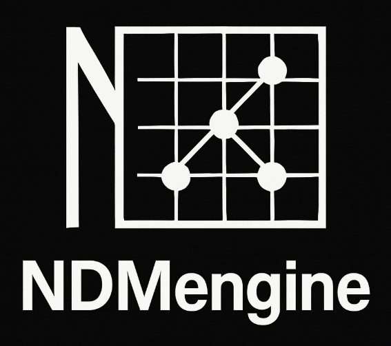

# NDMengine

<p align="center">
  
</p>

[](https://marco-oj.no)
[](#usage)
[](#installation)
[](#status)
[](docs/NDMengine.pdf)

NDMengine is a small, header-only N-dimensional matrix / tensor engine for C++17 and later.  
It provides a single `NDMatrix<T>` container with row-major storage, bounds-checked indexing,
slicing, broadcasting and elementwise operations, with no external dependencies. :contentReference[oaicite:0]{index=0}

## Status

Experimental but usable.

Core functionality (construction, indexing, reshape, slicing, broadcasting, elementwise and
scalar operations) is implemented and documented. Interfaces may still evolve as it’s used
in more numerical and financial modeling projects. :contentReference[oaicite:1]{index=1}

## Features

- Header-only, dependency-free C++17 API
- Arbitrary-rank tensors via `NDMatrix<T>`
- Row-major storage with explicit shape and stride handling
- Safe indexing via `at({i,j,k})` and variadic `operator()(i,j,k,...)`
- Flat access and introspection: `size()`, `operator[]`, `dimensions()`
- Reshape without data movement: `reshape({...})`
- Submatrix extraction: `view(start, extent)` and dimensional reduction via `slice(axis, index)`
- Elementwise tensor operators: `+`, `-`, `*`, `/`
- Scalar (0-D) broadcasting for matrix–scalar arithmetic
- NumPy-style trailing-axis broadcasting rules :contentReference[oaicite:2]{index=2}

## Installation

NDMengine is a single header:

```
text
include/
  NDMengine.hpp
```

Add the `include` directory to your compiler's include path and:

```
#include "NDMengine.hpp"

```

No separate build step is required.

## Usage

Basic construction and indexing:

```
#include "NDMengine.hpp"
#include <iostream>

int main() {
    NDMatrix<double> A({2, 3}, 1.5);   // 2x3 tensor, filled with 1.5
    A(0, 1)       = 4.0;               // variadic indexing
    A.at({1, 2})  = 7.0;               // explicit multi-index

    for (std::size_t i = 0; i < 2; ++i) {
        for (std::size_t j = 0; j < 3; ++j) {
            std::cout << A(i, j) << " ";
        }
        std::cout << "\n";
    }
}

```

Elementwise operations and scalar broadcasting:

```
NDMatrix<double> X({2, 2}, 1.0);
NDMatrix<double> Y({2, 2}, 2.0);

auto Z  = X + Y;      // elementwise add
auto W  = Z * 0.5;    // scalar broadcast
auto W2 = W + 1.0;    // chained scalar ops

```

Slicing:

```
NDMatrix<int> M({4, 4}, 0);
// ... fill M ...
NDMatrix<int> sub = M.view({1, 1}, {2, 2}); // 2x2 submatrix

```
